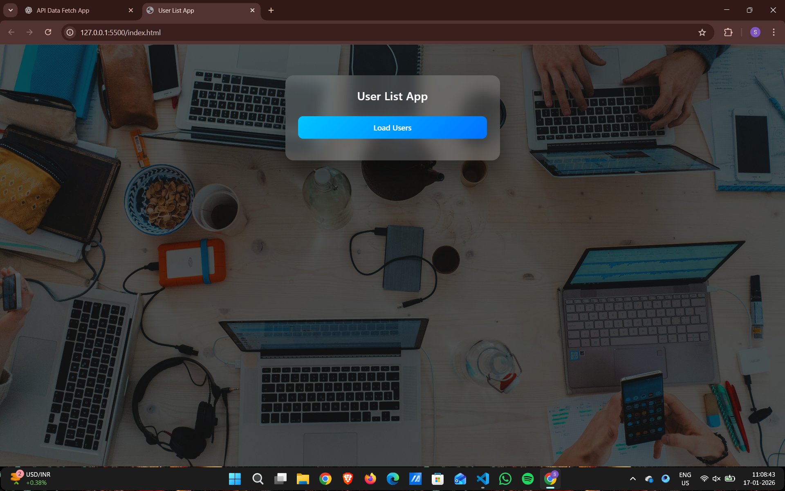
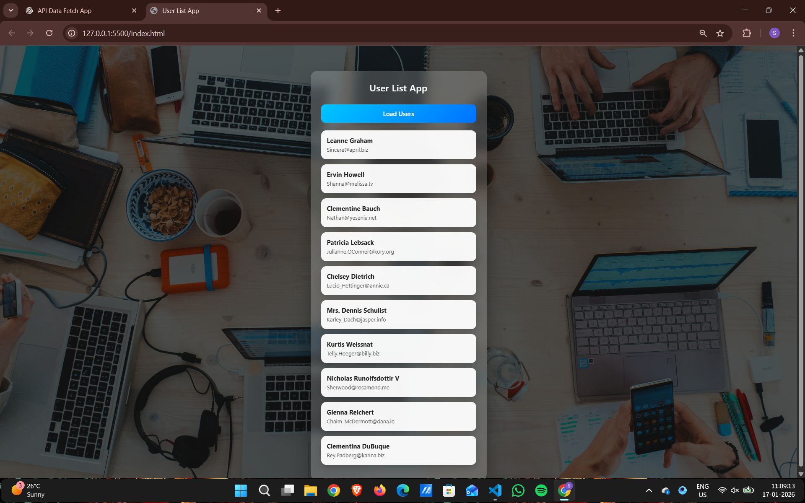

# User List App – API Data Fetch Project

A simple and clean web application that fetches user data from an external API and displays it on the UI.  
This project demonstrates my understanding of **Async JavaScript**, **API integration**, and **DOM manipulation**.

---

## 🚀 Live Features

- Fetches user data on button click
- Displays user name and email
- Shows loading state while fetching data
- Handles API errors gracefully
- Premium glassmorphism UI with background image

---

## 🛠️ Technologies Used

- HTML5
- CSS3 (Glassmorphism, Gradients)
- JavaScript (ES6+)
- Fetch API
- Async / Await

---

## 📌 Project Purpose

This project was built to practice and demonstrate:

- How asynchronous JavaScript works
- How to fetch data from a REST API
- How to handle loading and error states
- How to dynamically update the DOM
- Writing clean and readable code

---

## 🔄 API Used

https://jsonplaceholder.typicode.com/users

This is a free fake REST API for testing and learning purposes.

---

## 🧠 JavaScript Logic Flow

1. User clicks the **Load Users** button
2. A loading message is shown
3. Data is fetched using `fetch()` with `async/await`
4. API response is converted to JSON
5. User data is displayed dynamically
6. Error message is shown if fetch fails

---

## 📁 Project Structure

user-list-app/
│
├── index.html
├── style.css
└── script.js

hrough this project, I improved my understanding of:

- Asynchronous JavaScript
- REST APIs
- Error handling in JavaScript
- UI/UX improvement using CSS

---

## 🙌 Acknowledgement

API provided by [JSONPlaceholder](https://jsonplaceholder.typicode.com/)

---

## 🔗 Author

**Sushant Chaudhari**  
Aspiring Frontend Developer  